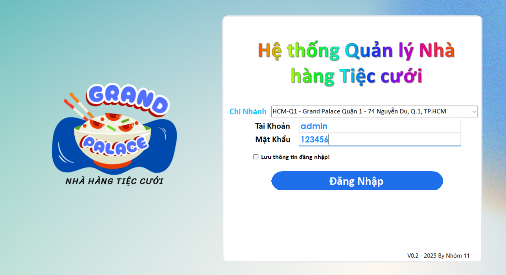

<p align="center">
  
</p>

<p align="center">
  
</p>

<p align="center">
  
  
  
</p>

## QLNhaHangTiecCuoi – Ứng dụng Quản lý Nhà hàng & Tiệc cưới (WinForms .NET 9)

### Giới thiệu
Ứng dụng desktop giúp quản lý hoạt động nhà hàng/tiệc cưới: chi nhánh, khu vực/sảnh, bàn, khách hàng, thực đơn, và quy trình đặt bàn/đặt tiệc. Dự án tổ chức theo mô hình nhiều tầng với `UI` (WinForms), `BLL`, `DAL` và `Share` để dễ bảo trì và mở rộng.

### Công nghệ sử dụng
- **.NET**: net9.0-windows (Windows Forms)
- **IDE**: Visual Studio 2022 (17.14+) hoặc `dotnet SDK 9`
- **NuGet**: `Microsoft.Extensions.Configuration`, `Microsoft.Extensions.Configuration.Json`, `Microsoft.Extensions.DependencyInjection`
- **CSDL**: Microsoft SQL Server (script khởi tạo kèm theo)

### Cấu trúc giải pháp
- `UI/`: Ứng dụng WinForms (entry point), tham chiếu tới `BLL`, `DAL`, `Share`
- `BLL/`: Business Logic Layer (xử lý nghiệp vụ)
- `DAL/`: Data Access Layer (truy cập dữ liệu)
- `Share/`: Chia sẻ mô hình/tiện ích chung
- `sql_QL-NhaHang-V3.sql`: Script tạo cơ sở dữ liệu và các bảng lõi
- `QLNhaHangTiecCuoi.sln`: Solution cho toàn bộ dự án

### Yêu cầu hệ thống
- Windows 10/11
- SQL Server (Express/Developer/Standard)
- Visual Studio 2022 17.14+ (khuyến nghị) hoặc `dotnet SDK 9`

### Thiết lập nhanh
1) Clone dự án
```powershell
git clone <your-repo-url>
cd QLNhaHangTiecCuoi
```

2) Khởi tạo cơ sở dữ liệu
- Mở `sql_QL-NhaHang-V3.sql` trong SSMS và Execute, hoặc dùng `sqlcmd`:
```powershell
sqlcmd -S . -E -i sql_QL-NhaHang-V3.sql
```
Script sẽ tạo database `QL_NhaHangTiecCtuoi_V3` và các bảng như `chi_nhanh`, `khu_vuc`, `ban`, `sanh`, `khach_hang`, `mon_an`, ...

3) Cấu hình kết nối CSDL
- Trong `UI/App.config` (hoặc nơi quản lý cấu hình), cập nhật `connectionStrings` trỏ tới SQL Server của bạn.

4) Khôi phục gói NuGet
- Mở Solution trong Visual Studio, Restore NuGet tự động; hoặc dùng CLI:
```powershell
dotnet restore
```

### Build & chạy
- Cách 1 (Visual Studio): Mở `QLNhaHangTiecCuoi.sln` → chọn project `UI` làm Startup → F5
- Cách 2 (CLI):
```powershell
dotnet build UI/UI.csproj -c Release
dotnet run --project UI/UI.csproj -c Release
```

### Ghi chú triển khai
- Project `UI` nhắm tới `net9.0-windows` và bật `UseWindowsForms`.
- Dự án đã cấu hình `ProjectReference` tới `BLL`, `DAL`, `Share`. Đảm bảo tất cả dự án con build thành công.
- NuGet ưu tiên dạng `PackageReference` trong `UI.csproj`. Tệp `packages.config` còn lại nhằm tương thích, không cần chỉnh trừ khi bạn chuyển hoàn toàn sang SDK-style.

### CSDL (khái quát)
- `chi_nhanh`, `khu_vuc`, `ban`: quản lý sơ đồ mặt bằng theo chi nhánh/khu vực/bàn
- `sanh`: quản lý các sảnh tiệc và phí thuê cơ bản
- `khach_hang`: thông tin khách hàng
- `mon_an`: thực đơn, đơn giá, đơn vị tính
- Các ràng buộc và chỉ mục cơ bản đã được định nghĩa trong script để đảm bảo toàn vẹn dữ liệu

### Định hướng phát triển
- Bổ sung màn hình quản lý đặt bàn/đặt sảnh, báo cáo doanh thu
- Áp dụng DI đầy đủ giữa `UI` ↔ `BLL` ↔ `DAL`
- Bổ sung kiểm thử tự động cho lớp nghiệp vụ

### Đóng góp
Mở issue/PR với mô tả rõ ràng. Giữ code dễ đọc, đặt tên biến/hàm có ý nghĩa, và tuân thủ chuẩn định dạng hiện có.

### Ảnh minh họa
<p align="center">
  
</p>

<p align="center">
  
</p>

### Giấy phép
Vui lòng xem `LICENSE.txt` trong repo.
